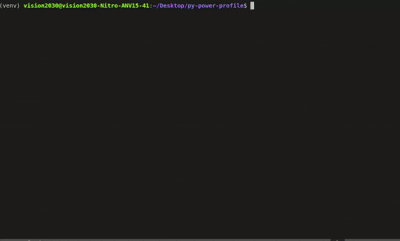

# py-power-profile 🔋 | Python Energy Profiling Tool

[](https://pypi.org/project/py-power-profile/)
[](https://www.python.org/downloads/)
[](https://opensource.org/licenses/MIT)
[](https://github.com/psf/black)

> **Profile and visualize energy consumption of Python code** on laptops, desktops, and Raspberry Pi devices. No external services or paid APIs required.



## 🚀 Quick Start

```bash
# Install py-power-profile
pip install py-power-profile

# Profile your Python script
py-power profile your_script.py --output results.json

# Generate energy badge
py-power badge results.json --target 100
```

## ✨ Key Features

- **🔋 Real-time Energy Profiling**: Measure CPU energy consumption at function and line level
- **🖥️ Multi-Platform Support**: Works on Intel/AMD (RAPL), ARM (hwmon), and universal fallback
- **📊 Rich Visual Reports**: Beautiful tables with energy breakdowns and visual progress bars
- **🔄 Performance Comparison**: Diff two runs to detect energy regressions and improvements
- **🏷️ CI/CD Integration**: Generate Shields.io-compatible badges for GitHub/GitLab
- **⚡ Low Overhead**: <5% CPU overhead, <150MB memory footprint
- **🔧 Zero Configuration**: Auto-detects best energy measurement backend

## 📦 Installation

### Basic Installation
```bash
pip install py-power-profile
```

### With RAPL Support (Intel/AMD Processors)
```bash
pip install py-power-profile[rapl]
```

### Development Installation
```bash
git clone https://github.com/Sherin-SEF-AI/py-power-profile.git
cd py-power-profile
pip install -e .[dev]
```

## 🛠️ Usage Examples

### Profile Energy Consumption
```bash
# Basic profiling
py-power profile my_script.py

# Save results to JSON
py-power profile my_script.py --output energy_results.json

# Use specific backend
py-power profile my_script.py --backend rapl

# Line-level profiling (higher accuracy)
py-power profile my_script.py --line
```

### Compare Performance Changes
```bash
# Compare two profiling runs
py-power compare old_results.json new_results.json
```

### Generate Energy Badges
```bash
# Generate badge for CI/CD
py-power badge results.json --target 100 --output badge.svg

# Status-only badge
py-power badge results.json --target 100 --status-only
```

## 🔧 Supported Energy Measurement Backends

### 🖥️ Intel/AMD RAPL (Recommended)
- **Accuracy**: High (hardware-level measurement)
- **Requirements**: Intel/AMD processor with RAPL support
- **Installation**: `pip install py-power-profile[rapl]`

### 📱 ARM/Raspberry Pi HWMON
- **Accuracy**: High (hardware sensors)
- **Requirements**: ARM device with power sensors
- **Availability**: Raspberry Pi, ARM-based systems

### 💻 Universal PSUTIL Estimation
- **Accuracy**: Medium (CPU usage estimation)
- **Requirements**: None (fallback option)
- **Availability**: All systems

### 🧪 Mock Backend (Testing)
- **Accuracy**: Deterministic (for testing)
- **Use Case**: Unit tests, CI/CD
- **Availability**: All systems

## 📊 Output Formats

### Rich Console Tables
```
Energy Profile Results (Backend: rapl)
┏━━━━━━━━━━━━━━━━━━━━━━━━━━━━━━━━━━━━━━━━━━━━━━━━━━━━┳━━━━━━┳━━━━━━━┳━━━━━━┳━━━━━━━┳━━━━━━┓
┃ Function                                           ┃ Calls┃ Energy┃ Avg   ┃ Time   ┃ %     ┃
┡━━━━━━━━━━━━━━━━━━━━━━━━━━━━━━━━━━━━━━━━━━━━━━━━━━━━╇━━━━━━╇━━━━━━━╇━━━━━━╇━━━━━━━╇━━━━━━┩
│ my_script.py:heavy_computation                     │  100 │ 1500mJ│ 15.0mJ│ 50.0ms │ 75.0% │
│ my_script.py:light_operation                       │   10 │  100mJ│ 10.0mJ│  5.0ms │  5.0% │
└────────────────────────────────────────────────────┴──────┴───────┴──────┴───────┴──────┘
```

### JSON Output
```json
{
  "metadata": {
    "backend": "rapl",
    "line_level": false,
    "timestamp": 1640995200.0
  },
  "functions": {
    "my_script.py:heavy_computation": {
      "calls": 100,
      "total_energy_mj": 1500.0,
      "avg_energy_mj": 15.0,
      "total_time_ms": 50.0
    }
  },
  "summary": {
    "total_energy_mj": 2000.0,
    "total_time_ms": 100.0,
    "function_count": 5
  }
}
```

### SVG Badges


## ⚙️ Configuration

### Environment Variables
```bash
export PY_POWER_BACKEND="rapl"
export PY_POWER_TDP_WATTS="15"
export PY_POWER_ENERGY_BUDGET_MJ="1000"
```

### pyproject.toml Configuration
```toml
[tool.py-power-profile]
backend = "auto"
tdp_watts = 15          # CPU TDP for estimation
energy_budget_mj = 1000 # CI threshold
ignore = ["tests/*"]    # glob patterns
```

## 🔄 GitHub Actions Integration

```yaml
name: Energy Profile
on: [push, pull_request]

jobs:
  energy-profile:
    runs-on: ubuntu-latest
    steps:
    - uses: actions/checkout@v4
    
    - name: Set up Python
      uses: actions/setup-python@v4
      with:
        python-version: '3.9'
    
    - name: Install py-power-profile
      run: pip install py-power-profile[rapl]
    
    - name: Run energy profile
      run: py-power profile tests/test_script.py --output results.json
    
    - name: Generate badge
      run: py-power badge results.json --target 100 --output badge.svg
    
    - name: Upload results
      uses: actions/upload-artifact@v3
      with:
        name: energy-results
        path: [results.json, badge.svg]
```

## 🧪 Testing

```bash
# Run all tests
pytest

# Run with coverage
pytest --cov=py_power_profile

# Test specific backend
py-power profile samples/quick.py --backend mock
```

## 📈 Performance Benchmarks

| Metric | Value |
|--------|-------|
| Profiling Overhead | <5% CPU |
| Memory Footprint | <150MB |
| Supported Python | 3.9+ |
| Supported OS | Linux, macOS, Windows |

## 🤝 Contributing

We welcome contributions! Please see our [Contributing Guide](CONTRIBUTING.md) for details.

### Development Setup
```bash
git clone https://github.com/Sherin-SEF-AI/py-power-profile.git
cd py-power-profile
pip install -e .[dev]
pre-commit install
```

## 📚 Documentation

- [Installation Guide](docs/installation.md)
- [API Reference](docs/api.md)
- [Accuracy Guide](docs/accuracy.md)
- [Troubleshooting](docs/troubleshooting.md)

## 🔍 Use Cases

### Software Development
- **Performance Optimization**: Identify energy-intensive functions
- **Code Review**: Energy impact analysis in pull requests
- **CI/CD**: Automated energy regression detection

### Research & Academia
- **Algorithm Analysis**: Compare energy efficiency of algorithms
- **System Research**: Energy consumption studies
- **Green Computing**: Sustainable software development

### IoT & Embedded Systems
- **Battery Life**: Optimize Python applications for battery-powered devices
- **Raspberry Pi**: Energy profiling on ARM devices
- **Edge Computing**: Resource-constrained environments

## 🏆 Why py-power-profile?

- **🔬 Scientific Accuracy**: Hardware-level energy measurement
- **🚀 Easy Integration**: Simple CLI with rich output
- **🔧 Flexible Configuration**: Multiple backends and options
- **📊 Professional Reports**: Beautiful, informative output
- **🔄 CI/CD Ready**: GitHub Actions and badge integration
- **📱 Cross-Platform**: Works on laptops, desktops, and SBCs

## 📄 License

This project is licensed under the MIT License - see the [LICENSE](LICENSE) file for details.

## 🙏 Acknowledgments

- [pyRAPL](https://github.com/powerapi-ng/pyRAPL) for Intel/AMD RAPL support
- [Rich](https://github.com/Textualize/rich) for beautiful terminal output
- [Typer](https://github.com/tiangolo/typer) for CLI framework

## 📞 Support

- **GitHub Issues**: [Report bugs](https://github.com/Sherin-SEF-AI/py-power-profile/issues)
- **Discussions**: [Community support](https://github.com/Sherin-SEF-AI/py-power-profile/discussions)
- **Email**: sherin.joseph2217@gmail.com

---

**Made with ❤️ by [sherin joseph roy](https://github.com/Sherin-SEF-AI)**

*Empowering developers to build energy-efficient Python applications* 